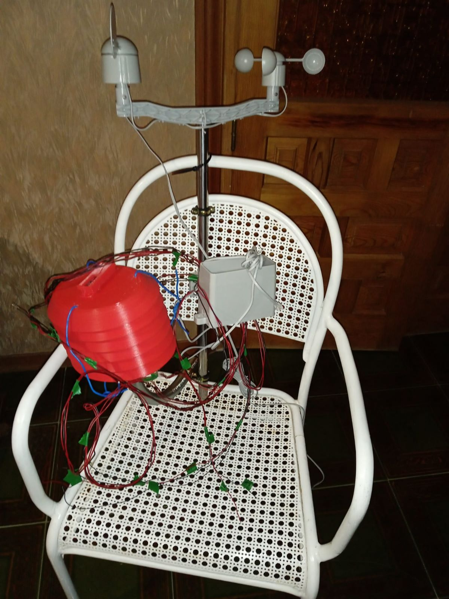
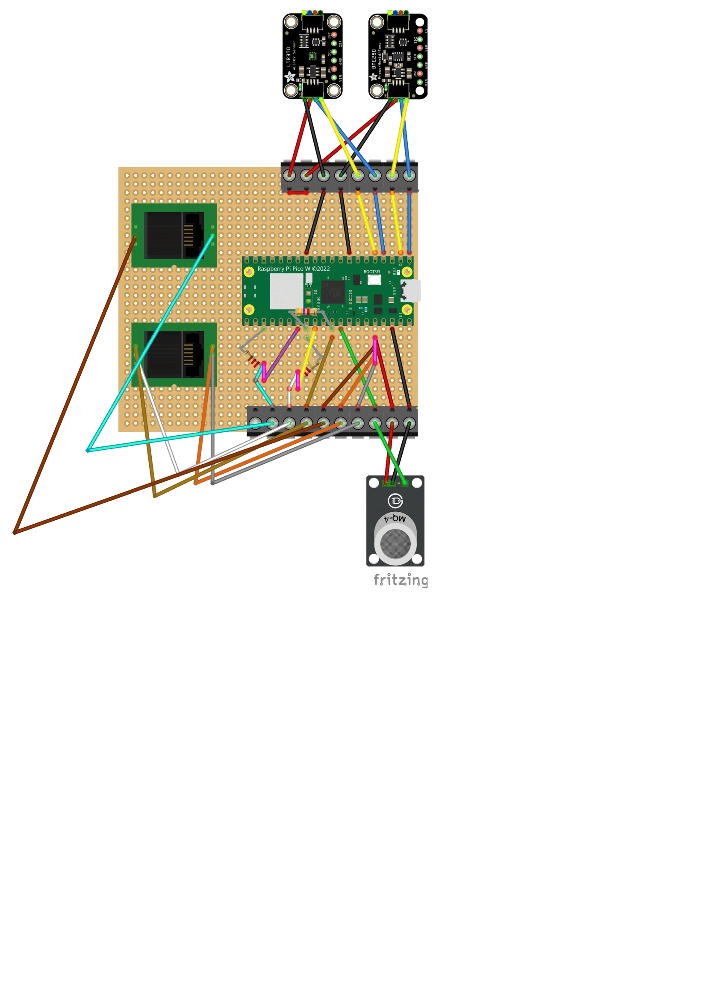
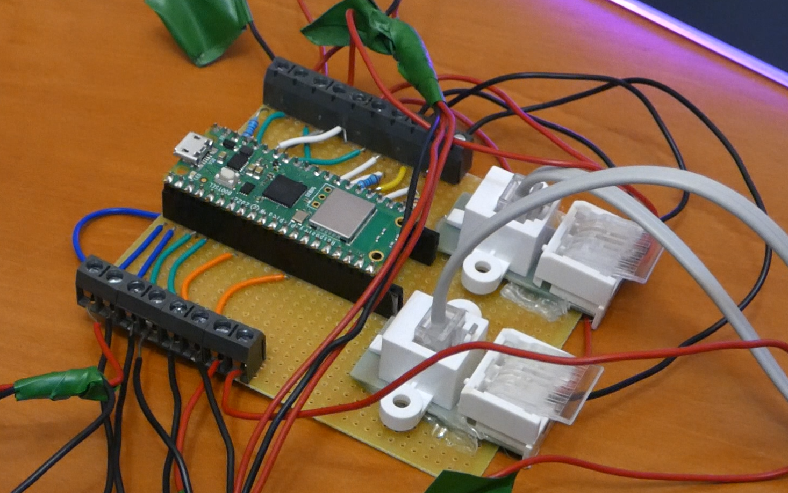
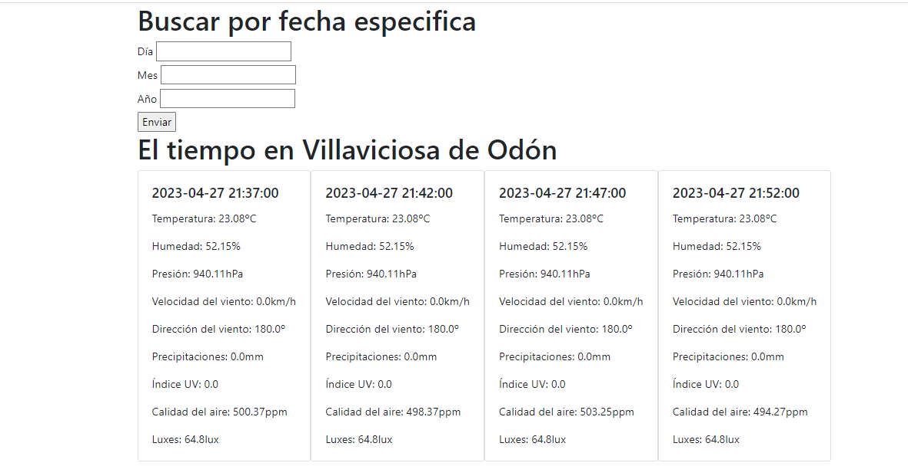
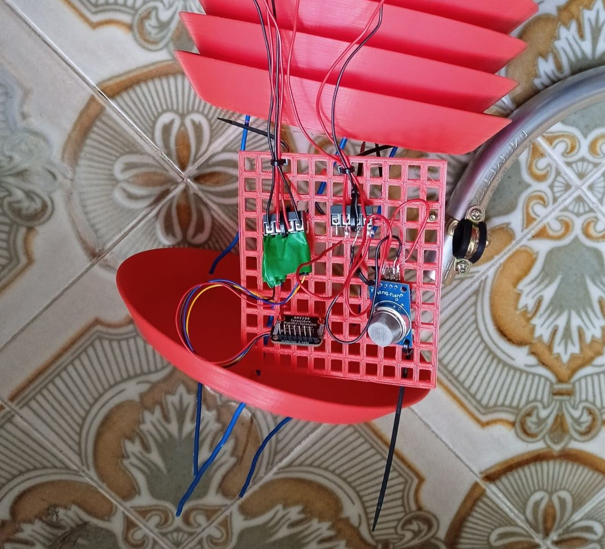

# Para sanarlo hay que estudiarlo [Estación meteorológica]
## Presentación
Esta estación meteorológica sirve para medir la temperatura, humedad, presión, luxes, índice UV, velocidad del viento, dirección del viento y precipitaciones.

## Pagina Web donde ver los datos del tiempo
> En construcción.
## Materiales
- 1x Raspberry Pi Pico W
- 1x BME280
- 1x LTR390
- 1x MQ-135
- 1x [Kit de anemómetro, veleta y pluviometro.](https://www.argentdata.com/catalog/product_info.php?products_id=145)
- 2x Cables STEMMA QT
- 2x Conectores RJ11
- 9x Conectores de tornillo de 2 pines
- 1x Resistencias de 2k ohm
- 2x Resistencia de 4.7k ohm
- 1x Prefboard
## Esquema de conexiones
- Los cables de color ocre son conexiones hechas con estaño hechas por debajo.
- Es mejor soldar a la placa unos pines hembra para poder sacar y poner la Raspberry Pi Pico W.

## Programación
### Raspberry Pi Pico W
1. Mantén el botón BOOT presionado y conecta la Raspberry Pi Pico W al ordenador.
2. Descargar CircuitPython 8.x [aquí](https://circuitpython.org/board/raspberry_pi_pico_w/).
3. Arrastrar el archivo .u2f a la carpeta de la Raspberry Pi Pico W.
4. Descargar el bundle versión 8.x [aquí](https://circuitpython.org/libraries).
5. Descomprime el bundle y copia a la carpeta lib de las Raspberry Pi Pico W las siguientes librerías:
- adafruit_bme280
- adafruit_httpserver
- adafruit_register
- asyncio
- adafruit_ltr390.mpy
- adafruit_ticks.mpy
- adafruit_datetime.mpy
- adafruit_requests.mpy
6. Descargue Thonny [aquí](https://thonny.org/).
7. Abra Thonny y seleccione la Raspberry Pi Pico W como dispositivo.
8. Copie la carpeta de tests a la Raspberry Pi Pico W.
9. Compruebe que cada sensor funcione.
10. Copie el archivo main.py y settings.json a la Raspberry Pi Pico W.
11. Modifique el settings.json con los datos de su red wifi
12. Ejecute el archivo main.py
13. Y en su navegador vaya a la dirección ip 192.168.1.160/data (o la que tenga asignada) y vera como cada 15 segundos o los que quiera se actualizan los datos.
14. Cabe destacar que solo empezara a dar datos cuando los minutos acaben en 0 o 5 para que los datos cuando sean alamacenados queden más bonitas las fechas.
### Servidor
#### Poniendo en marcha la base de datos
1. Descargue e instale mariadb [aquí](https://mariadb.org/download/).
2. Ejecute script.sql en la base de datos.
#### Almacenando datos en la base de datos
1. Instale los siguientes módulos de python con pip install -r requirements.txt.
2. Descargue el archivo store.py y ejecútelo configurando cada cuánto tiempo quiere almacenar los datos.
3. Lo tendrá que hacer que se ejecute en segundo plano.
4. Ten en cuenta que este programa se adapta automaticamente a la cantidad de tiempo que hayas puesta en la configuración de la Raspberry PI Pico W.
#### Página Web
1. Descargue la carpeta app y ejecute main.py.
2. Recuerde que en host tiene que poner la ip de su ordenador.

### Creación de los procesos en segundo plano
Esto solo se aplica para linux (yo lo he hecho en Ubuntu 22.04 aunque ddeberia funcionanar para cualquier linux).
1. Descarge los archivos archivos tiempo_store.service y tiempo_web.service y pongalos en /etc/systemd/system.
2. Cambie en los dos archivos las rutas de donde esta la carpeta y donde esta el archivo que se tiene que ejecutar en los campos WorkingDirectory y ExecStart, no se olvide de poner su nombre de usuario en el campo User.
3. Ejecute sudo systemctl daemon-reload.
4. Ejecute sudo systemctl start tiempo_store.service y sudo systemctl start tiempo_web.service para iniciarlos.
5. Ejecute sudo systemctl enable tiempo_store.service y sudo systemctl enable tiempo_web.service para que se inicien al encender el ordenador.
6. Ejecute sudo systemctl status tiempo_store.service y sudo systemctl status tiempo_web.service para comprobar que se estan ejecutando.
7. Una cosa buena de este sistema esque si uno de los procesos da error se reiniciara automaticamente.
## Montaje
1. Imprime una Stevenson screen para que los sensores no estén expuestos al sol y solo midan la temperatura del aire aunque os recomiendo que el sensor grid lo imprimáis un poco más pequeño para que quepa. Luego hacer un agujero en la parte de abajo para llevar los cables [Descargar](https://www.thingiverse.com/thing:1718334/files). Podéis poner los sensores en el sensor grid y os quedaría tal que así:

Y para el LTR390 tenéis esta carcasa [Descargar](https://www.thingiverse.com/thing:5388692). Aunque yo he hecho una modificación para que sea un poco más amplia y entre mejor lo tenéis en la carpeta impresora 3D. Y luego lo podéis poner en la parte de arriba de la Stevenson screen con silicona caliente y hacer un agujero en la parte de abajo para llevar los cables.
## Agradecimientos
Muchas gracias a mi familia, mis amigos y profesores por el apoyo que me han dado para hacer este proyecto. 